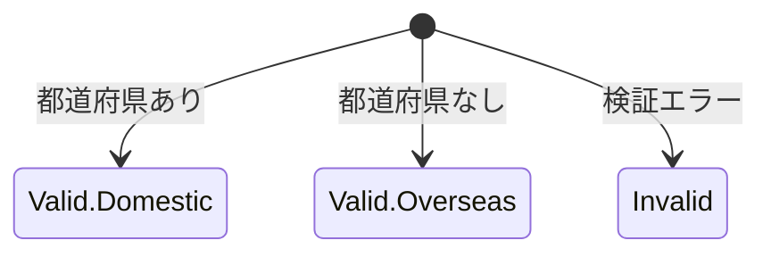

# 配送先住所
ドメインタイプ:  値
永続化単位:  false

## 概要
// for developer: insert this business meaning of this domain-term as a comment at the top of the file.

配送先となる住所です

## 登場する語彙
// for developer: import the following domain-term

- 都道府県
- 住所詳細

## 情報構造
// for developer: Developers: represent the state and subset structure of this domain-term as an **ADT**.(represent the sum type in Kotlin using a sealed interface.)

### 住所の分類
- **有効な住所（Valid）**
    - **国内住所（Domestic）**
        - 都道府県
        - 住所詳細
    - **海外住所（Overseas）**
        - 住所詳細（都道府県は持たない）
- **無効な住所（Invalid）**
    - 都道府県（nullable）
    - 住所詳細
    - 無効理由

### 付随する情報
// for developer: define the property as a method.

- 国内住所かどうか？
- 有効な住所か？
- 表示形式での住所

## 状態遷移
// for developer: represent the state transition functions and their constraints using functions and types.

## 状態遷移アクション
// for developer: write an action function in the companion object that changes the state of this domain-term.

### 文字列からの生成
- from: 文字列
    - 「県」&「住所」の文字列情報
- into: 有効な住所または無効な住所

## ビジネスルール
// for developer: declare each business rule with a single function.

### 住所詳細の検証
- 住所詳細は必須（空文字は不可）
- 前後の空白は自動的にトリミング

### 都道府県の解析
- 都道府県が空欄の場合は海外住所として扱う
- 入力された都道府県名は有効な都道府県である必要がある
- 前後の空白は自動的にトリミング

### 住所の生成
- 都道府県が指定されている場合は国内住所
- 都道府県が指定されていない場合は海外住所
