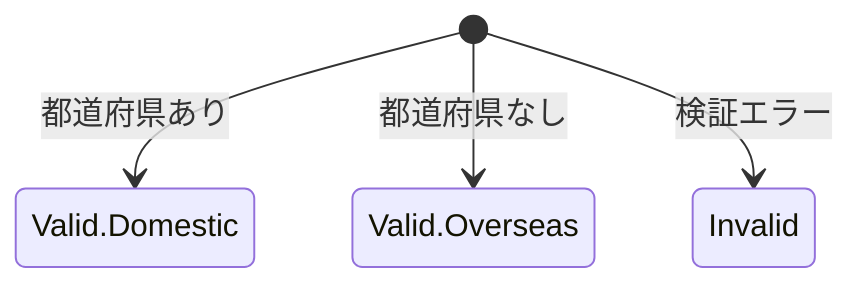

# 語彙

ドメインタイプ:  業務資源 | 業務手順 | 設定情報 | 業務ポリシー | 値 | ビュー

永続化単位:  true | false

## 概要

// for developer: insert this business meaning of this domain-term as a comment at the top of the file.

- その語彙の業務上の役割と目的を要約

### 具体例

// for developer: exclude this section from encoding.

- その概念の具体例を記載

## 登場する語彙

// for developer: import the following domain-term

- 説明中に登場する他の語彙を記載

## 情報構造

// for developer: Developers: represent the state and subset structure of this domain-term as an **ADT**.(represent the sum type in Kotlin using a sealed interface.)

### カテゴリ/サブセット構造や状態構造

- **状態１**
    - **サブセット１**
        - 項目: 項目を記載
    - **サブセット２**
        - 項目: 項目を記載
- **状態２**
    - 項目: 項目を記載

### 付随する情報

// for developer: define the property as a method.

- その語彙に付随する述語や派生情報、プロパティ

## 状態遷移

// for developer: represent the state transition functions and their constraints using functions and types.

## 状態遷移アクション

// for developer: write an action function in the companion object that changes the state of this domain-term.

### アクション１

- from: 遷移元
- into:  遷移先

## ビジネスルール

// for developer: declare each business rule with a single function.

- 不変条件や計算ルール・判定ルール
