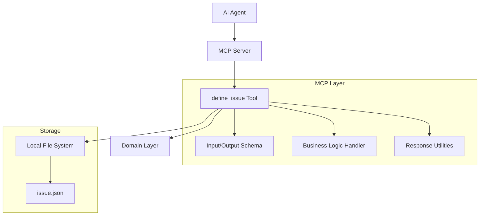
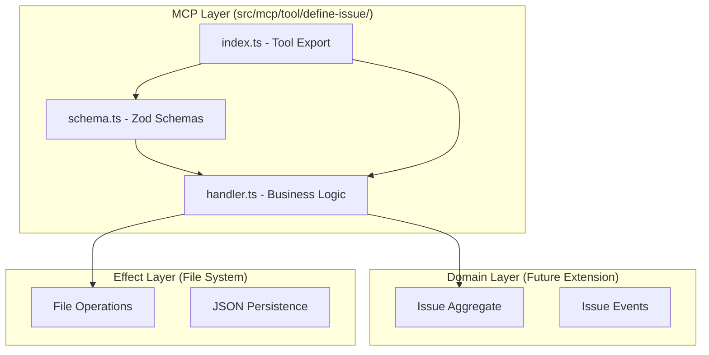

# Design Document

## Overview

「define_issue」ツールは、WRAP意思決定フレームワークの課題定義段階を支援するMCPツールです。AI Agentが意思決定プロセスを開始する際に、課題の本質を明確化し、構造化された形でローカルファイルシステムに保存します。

このツールは既存のMCPアーキテクチャパターンに従い、Zod スキーマによる入力検証、Result型による関数型エラーハンドリング、構造化出力をサポートします。

## Architecture

### System Context


### Layer Architecture


## Components and Interfaces

### Input Schema (Zod)
```typescript
const defineIssueSchema = z.object({
  issue: z.string()
    .min(1, "課題は必須です")
    .max(30, "課題は30文字以内で入力してください")
    .describe("意思決定が必要な課題（1〜30文字）"),
  
  context: z.string()
    .min(1, "コンテキストは必須です")
    .max(60, "コンテキストは60文字以内で入力してください")
    .describe("課題の背景情報（マークダウン形式、1〜60文字）"),
  
  constraints: z.string()
    .min(1, "制約は必須です")
    .max(60, "制約は60文字以内で入力してください")
    .describe("意思決定における制約条件（マークダウン形式、1〜60文字）")
});
```

### Output Schema (Structured Response)
```typescript
const defineIssueOutputSchema = z.object({
  issue: z.string().describe("登録された課題")
});
```

### Handler Interface
```typescript
export const defineIssueHandler = async (
  args: DefineIssueParams
): Promise<CallToolResult> => {
  // 1. 入力検証
  // 2. 課題データの構造化
  // 3. ファイルシステムへの保存
  // 4. 構造化レスポンスの生成
  // 5. 次のアクション指示の提供
}
```

## Data Models

### Issue Data Structure
```typescript
interface IssueDefinition {
  issue: string;           // 課題（1〜30文字）
  context: string;         // コンテキスト（マークダウン、1〜60文字）
  constraints: string;     // 制約（マークダウン、1〜60文字）
}
```

### File Storage Format
```json
{
  "issue": "新しいプロダクト機能の優先順位決定",
  "context": "リソースが限られている中で、**ユーザー価値**と**技術的実現可能性**を両立する必要がある",
  "constraints": "- 開発期間: 3ヶ月以内\n- 予算: 500万円以下\n- チーム規模: 5名"
}
```

### Storage Location
- **Path**: `./data/issue.json`
- **Behavior**: 同一ツールの再実行時は上書き保存
- **Format**: UTF-8 encoded JSON

## Error Handling

### Validation Errors
```typescript
// 入力検証エラーのパターン
const ValidationErrors = {
  ISSUE_REQUIRED: "課題は必須です",
  ISSUE_TOO_LONG: "課題は30文字以内で入力してください",
  CONTEXT_REQUIRED: "コンテキストは必須です", 
  CONTEXT_TOO_LONG: "コンテキストは60文字以内で入力してください",
  CONSTRAINTS_REQUIRED: "制約は必須です",
  CONSTRAINTS_TOO_LONG: "制約は60文字以内で入力してください"
} as const;
```

### File System Errors
```typescript
// ファイル操作エラーのパターン
const FileSystemErrors = {
  DIRECTORY_CREATE_FAILED: "データディレクトリの作成に失敗しました",
  FILE_WRITE_FAILED: "課題定義ファイルの保存に失敗しました",
  PERMISSION_DENIED: "ファイルへの書き込み権限がありません"
} as const;
```

### Error Response Pattern
```typescript
// エラー時のレスポンス構造
const errorResponse = {
  content: [
    { type: "text", text: "エラーメッセージ" },
    { type: "text", text: "修正方法の具体的な指示" }
  ],
  isError: true
};
```

## Testing Strategy

### Unit Tests
```typescript
describe('defineIssueHandler', () => {
  describe('正常系', () => {
    it('有効な入力で課題定義が正常に保存される', async () => {
      // Given: 有効な課題定義パラメータ
      // When: ハンドラーが実行される
      // Then: 課題が保存され、issueのみの構造化レスポンスが返される
    });
    
    it('既存ファイルが上書きされる', async () => {
      // Given: 既存の課題定義ファイル
      // When: 新しい課題定義で再実行
      // Then: ファイルが上書きされる
    });
  });
  
  describe('異常系', () => {
    it('課題が空文字の場合、バリデーションエラーが返される', async () => {
      // Given: 空の課題文字列
      // When: ハンドラーが実行される
      // Then: バリデーションエラーが返される
    });
    
    it('文字数制限を超えた場合、エラーが返される', async () => {
      // Given: 30文字を超える課題文字列
      // When: ハンドラーが実行される  
      // Then: 文字数制限エラーが返される
    });
  });
});
```

### Integration Tests
```typescript
describe('define_issue Tool Integration', () => {
  it('MCPサーバーに正常に登録される', async () => {
    // Given: MCPサーバーが起動している
    // When: define_issueツールが登録される
    // Then: ツールリストに含まれる
  });
  
  it('ファイルシステムとの統合が正常に動作する', async () => {
    // Given: 書き込み可能なディレクトリ
    // When: 課題定義が実行される
    // Then: JSONファイルが正常に作成される
  });
});
```

## Implementation Details

### File System Operations
```typescript
import { promises as fs } from 'fs';
import { dirname } from 'path';

const DATA_DIR = './data';
const ISSUE_FILE = `${DATA_DIR}/issue.json`;

const ensureDataDirectory = async (): Promise<void> => {
  try {
    await fs.mkdir(DATA_DIR, { recursive: true });
  } catch (error) {
    throw new Error(`データディレクトリの作成に失敗: ${error}`);
  }
};

const saveIssueDefinition = async (
  issueData: IssueDefinition
): Promise<void> => {
  await ensureDataDirectory();
  const jsonData = JSON.stringify(issueData, null, 2);
  await fs.writeFile(ISSUE_FILE, jsonData, 'utf-8');
};
```

### Response Generation
```typescript
const generateSuccessResponse = (
  issue: string
): CallToolResult => {
  const structuredData = { issue };
  const nextActionGuidance = 
    "課題が正常に定義されました。次は「Widen Options（選択肢を広げる）」ステップに進み、" +
    "可能な解決策や選択肢を洗い出しましょう。";
  
  return toStructuredCallToolResult(
    [
      `課題「${issue}」を正常に登録しました。`,
      nextActionGuidance
    ],
    structuredData,
    false
  );
};
```

### Next Action Guidance
成功時の次のアクション指示:
- "課題が正常に定義されました。次は「Widen Options（選択肢を広げる）」ステップに進み、可能な解決策や選択肢を洗い出しましょう。"

失敗時の修正指示:
- バリデーションエラー: "入力内容を確認し、文字数制限内で再入力してください。"
- ファイルシステムエラー: "ファイルの書き込み権限を確認し、再実行してください。"

## Security Considerations

### Input Sanitization
- Zod スキーマによる厳密な入力検証
- 文字数制限による DoS 攻撃の防止
- マークダウン形式の入力に対する基本的なサニタイゼーション

### File System Security
- 相対パスによるディレクトリトラバーサル攻撃の防止
- 書き込み権限の適切な確認
- ファイルサイズ制限による容量攻撃の防止

## Performance Considerations

### File I/O Optimization
- 非同期ファイル操作の使用
- 必要時のみディレクトリ作成
- JSON シリアライゼーションの最適化

### Memory Usage
- 小さなデータサイズ（最大150文字程度）
- ストリーミング不要な軽量操作
- メモリリークの防止

## Future Extensions

### Domain Layer Integration
将来的にドメイン層との統合を行う場合:
```typescript
// src/domain/command/issue-definition/
// - aggregate.ts: 課題定義集約
// - events.ts: 課題定義イベント
// - types.ts: 課題定義型定義
```

### Event-Driven Architecture
```typescript
// 課題定義完了イベントの発行
const issueDefinedEvent: IssueDefinedEvent = {
  type: 'IssueDefinedEvent',
  issueId: generateIssueId(),
  issue: args.issue,
  context: args.context,
  constraints: args.constraints,
  definedAt: new Date().toISOString()
};
```

### Workflow State Management
```typescript
// ワークフロー状態の管理
interface DecisionWorkflowState {
  currentStep: 'issue-definition' | 'widen-options' | 'reality-test' | 'attain-distance' | 'prepare-wrong';
  issueId: string;
  completedSteps: string[];
  nextActions: string[];
}
```