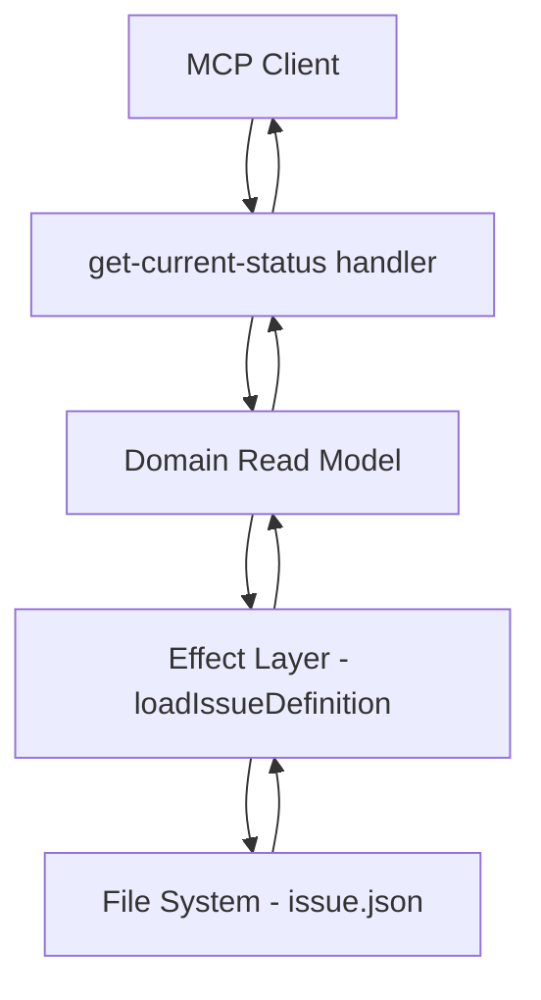

# Design Document

## Overview

現状把握ツール（get-current-status）は、WRAP意思決定フレームワークにおいて現在定義されている課題（Issue）情報を取得するためのMCPツールです。このツールは既存のdefine-issueツールと対をなし、課題の定義と取得の完全なCRUD操作を提供します。

## Architecture

### Layer Integration

```
MCP Layer (src/mcp/tool/get-current-status/)
├── schema.ts          # 入出力スキーマ定義
├── handler.ts         # ツールロジック実装
└── index.ts          # ツールエクスポート

Domain Layer (src/domain/read/)
└── current-status/    # 新規作成
    ├── index.ts       # クエリ関数
    └── types.ts       # 読み取り専用型定義

Effect Layer (src/effect/)
└── issue-storage.ts   # 既存ファイル（読み取り関数追加）
```

### Data Flow



## Components and Interfaces

### MCP Tool Interface

**Input Schema:**
```typescript
// パラメータなし - 現在の課題情報を単純に取得
const getCurrentStatusSchema = z.object({});
```

**Output Schema:**
```typescript
const getCurrentStatusOutputSchema = z.object({
  hasIssue: z.boolean().describe("課題が定義されているかどうか"),
  issue: z.string().optional().describe("課題のタイトル"),
  context: z.string().optional().describe("課題の背景情報"),
  constraints: z.string().optional().describe("制約条件"),
  createdAt: z.string().optional().describe("作成日時（ISO文字列）")
});
```

### Domain Read Model

**Query Function:**
```typescript
// src/domain/read/current-status/index.ts
export const getCurrentIssueStatus = async (): Promise<Result<IssueStatusView | null, ReadError>> => {
  // Effect層を通じて課題情報を取得
  // 存在しない場合はnullを返す（エラーではない）
  // ファイルシステムエラーの場合のみエラーを返す
};
```

**View Types:**
```typescript
// src/domain/read/current-status/types.ts
export type IssueStatusView = {
  readonly issue: string;
  readonly context: string;
  readonly constraints: string;
  readonly createdAt: string; // ISO文字列
};

export type ReadError = {
  readonly type: 'FileSystemError';
  readonly message: string;
};
```

### Effect Layer Extensions

**既存のissue-storage.tsに追加:**
```typescript
// 課題の存在確認（既存）
export const issueDefinitionExists = async (): Promise<boolean>

// 課題定義の読み込み（既存）
export const loadIssueDefinition = async (): Promise<Result<IssueDefinition, FileSystemError>>
```

## Data Models

### Input/Output Models

```typescript
// 入力: パラメータなし
type GetCurrentStatusParams = {};

// 出力: 構造化されたレスポンス
type GetCurrentStatusResponse = {
  hasIssue: boolean;
  issue?: string;
  context?: string;
  constraints?: string;
  createdAt?: string;
};
```

### Domain Models

```typescript
// 読み取り専用ビューモデル
type IssueStatusView = {
  readonly issue: string;
  readonly context: string;
  readonly constraints: string;
  readonly createdAt: string;
};

// エラーモデル
type ReadError = {
  readonly type: 'FileSystemError';
  readonly message: string;
};
```

## Error Handling

### Error Categories

1. **No Error (課題未定義)**: 課題が定義されていない状態は正常な状態として扱う
2. **File System Error**: ファイル読み取り時のシステムエラー
3. **Data Corruption Error**: JSONデータの破損

### Error Handling Strategy

```typescript
// パターン1: 課題未定義（正常状態）
const handleNoIssue = (): CallToolResult => {
  return toStructuredCallToolResult(
    ["現在、課題は定義されていません。"],
    { hasIssue: false },
    false // エラーではない
  );
};

// パターン2: ファイルシステムエラー
const handleFileSystemError = (error: FileSystemError): CallToolResult => {
  return toStructuredCallToolResult(
    [`ファイルシステムエラー: ${error.message}`],
    null,
    true // エラー
  );
};

// パターン3: データ破損エラー
const handleDataCorruption = (): CallToolResult => {
  return toStructuredCallToolResult(
    ["課題データが破損しています。課題を再定義してください。"],
    null,
    true // エラー
  );
};
```

## Testing Strategy

### Unit Tests

1. **Schema Validation Tests**
   - 空のパラメータでの正常動作
   - 不正なパラメータでの適切なエラー

2. **Handler Logic Tests**
   - 課題存在時の正常レスポンス
   - 課題未定義時の正常レスポンス
   - ファイルシステムエラー時のエラーハンドリング
   - データ破損時のエラーハンドリング

3. **Domain Read Model Tests**
   - getCurrentIssueStatus関数の各種パターン
   - Result型の適切な使用

### Integration Tests

1. **End-to-End Flow Tests**
   - define-issue → get-current-status の連携
   - ファイルシステムとの実際の読み書き

2. **Error Scenario Tests**
   - ファイル権限エラー
   - ディスク容量不足
   - 不正なJSONデータ

## Implementation Patterns

### Functional Error Handling

```typescript
// Result型を使用した関数型エラーハンドリング
const getCurrentStatus = async (): Promise<Result<IssueStatusView | null, ReadError>> => {
  return loadIssueDefinition()
    .andThen(issueDefinition => {
      // IssueDefinitionをIssueStatusViewに変換
      const view: IssueStatusView = {
        issue: issueDefinition.issue,
        context: issueDefinition.context,
        constraints: issueDefinition.constraints,
        createdAt: issueDefinition.createdAt.toISOString()
      };
      return ok(view);
    })
    .orElse(error => {
      // ファイルが存在しない場合は正常状態としてnullを返す
      if (error.type === 'file_not_found') {
        return ok(null);
      }
      // その他のエラーは伝播
      return err({
        type: 'FileSystemError' as const,
        message: error.message
      });
    });
};
```

### Schema-First Design

```typescript
// Zodスキーマから型を導出
export type GetCurrentStatusParams = z.infer<typeof getCurrentStatusSchema>;
export type GetCurrentStatusResponse = z.infer<typeof getCurrentStatusOutputSchema>;

// スキーマファーストでバリデーション
export const getCurrentStatusHandler = async (args: unknown): Promise<CallToolResult> => {
  const zodResult = getCurrentStatusSchema.safeParse(args);
  if (!zodResult.success) {
    return toStructuredCallToolResult(["入力パラメータが無効です"], null, true);
  }
  // ... 処理続行
};
```

### Structured Output Pattern

```typescript
// 既存パターンに従った構造化出力
const generateSuccessResponse = (statusView: IssueStatusView | null): CallToolResult => {
  if (statusView === null) {
    return toStructuredCallToolResult(
      ["現在、課題は定義されていません。"],
      { hasIssue: false },
      false
    );
  }

  const structuredData: GetCurrentStatusResponse = {
    hasIssue: true,
    issue: statusView.issue,
    context: statusView.context,
    constraints: statusView.constraints,
    createdAt: statusView.createdAt
  };

  return toStructuredCallToolResult(
    [`現在の課題: ${statusView.issue}`],
    structuredData,
    false
  );
};
```

## Integration with Existing Architecture

### CQRS Pattern Compliance

- **Command Side**: define-issueツールが課題の作成を担当
- **Read Side**: get-current-statusツールが課題の読み取りを担当
- **Event Store**: ファイルシステム上のissue.jsonが永続化層

### Domain-Driven Design Alignment

- **Aggregate**: IssueDefinitionAggregate（既存）
- **Read Model**: CurrentStatusReadModel（新規）
- **Value Objects**: 既存のIssueText, ContextText, ConstraintText を再利用

### MCP Framework Integration

- **Tool Registration**: Server.tsに新しいツールを登録
- **Structured Output**: 既存のtoStructuredCallToolResultパターンを使用
- **Error Handling**: 既存のResult型パターンを踏襲