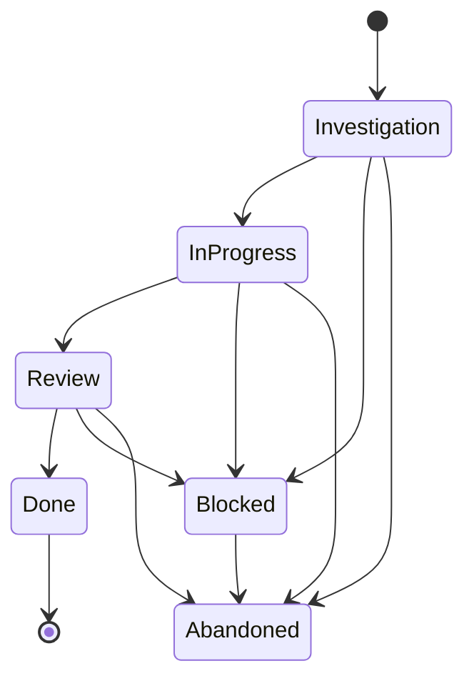

# mcp‑worktree — Product Requirements Document (Draft v0.1)

## 1. 背景 / Context
生成 AI コーディングエージェントの普及により、単独開発者でも複数エージェントを並列稼働させて機能開発を行う時代が到来している。しかし作業ラインが増えるほど、進捗の可視化・衝突防止・統合管理は人間の認知限界を超えやすい。
また、並行稼働を最大化するためには、各エージェントの進捗をリアルタイムで把握し、最適な並列数を動的に調整する必要がある。

## 2. 目的 / Goal
*複数エージェントによる“分岐・合流だらけ”の開発ラインを、人とエージェント双方が一枚の地図で把握・制御できるようにする。*
*人間・PM‑Agent、またはそれぞれの Coding Agent が策定した、錯綜するワークプラン/実装計画を管理する*
*動的に変化する開発進捗状況に応じて、常に最大にAgentを並行稼働させ、最速での開発完了を目指す*

## 3. 対象ユーザー / Target Users
* **ひとり開発者** がローカルまたはクラウドで複数の AI コーディングエージェント (Cursor, Claude‑Code, GPT‑Dev 等) を走らせるケース
* 小規模チームでエージェント混在開発を行う Tech Lead / PM Agent

## 4. 問題点 / Problem Statement
* エージェントごとに Git branch / worktree が乱立し、現状把握に時間を浪費
* その時々で最適な並列稼働Agent数がわからない。調整できない
* 同一機能の重複実装やマージ衝突を事後に発見しがち
* 現在のタスクステータスが可視化出来ない（調査中・実装中など）

## 5. ソリューション概要 / Solution Overview

`mcp‑worktree` は **進捗共有ハブ (Multi‑agent Control Point: MCP)** として機能し、以下を提供する。

1. **Central Progress Store**
   - 各ラインの完了/残タスク, 所有エージェント/作業worktreeを記録
   - 人間・PM‑Agent、またはそれぞれの Coding Agent が策定した、錯綜するワークプラン/実装計画を管理可能
2. **Agent Sync TOOL**
   - Coding Agentが mcp tool callによる push/pull で相互状況把握
   - Coding Agentが 自律的にワークプラン/実装計画を変更可能 
3. **Tracking TOOL**
   - 人間・PM‑Agent からのmcp tool callでワンショットで全体像を確認
   - 人間・PM‑Agent からのタスク更新指示を反映できる

## 6. MCP Tool 定義（最小コア）
**Model Context Protocol (MCP)** over stdio。

### Tool 一覧
🧠 1. plan
主な利用者: PM-Agentがマスタープランを策定、Coding Agentが新規チケットを自律的に起票
目的: 互いに依存の無い可能並行開発数を最大にした、PR単位でのマスタープランの作成、一括アップデート。全タスク再定義
現実アナロジー: 最短パスになるように全体タスクプランニング、branch切り、追加チケットの起票
機能要件:
- タスク計画全体をwriteできる
- 一括でリプランをwriteできる
  - 一括リプランを用いて、Coding Agentが自分のタスクを起票できることも含まれる

👤 2. assign
主な利用者: PM-AgentがCoding Agentをアサイン、Coding Agentがセルフアサイン
目的: 作業や責任をエージェントに割り当てる
現実アナロジー: 担当決定、責任の移譲、メンバーの参画
機能要件:
- Coding Agentが PrTask を自分にをアサインできる
- 手が空いたAgentは、現状を確認し、次に自分が行うべきタスクを自律判断する

📊 3. track
主な利用者: PM-Agentが状況確認、Coding Agentが自分および互いの状況を把握
目的: 状況の把握、モニタリング、サブスクライブ
現実アナロジー: スクラムボード、進捗一覧、レビュー準備
機能要件: 
- 現在のplanの全体状況がreadできる
- 現在の可能並行数と、稼働Coding Agent数がreadできる
- それぞれのタスクの概要や前後関係を知ることで、次に行うタスクのセルフアサインのための情報を収集できる

🔄 4. update
主な利用者: Coding Agentが自分のタスクを更新、PM-Agentが直接計画を微修正
目的: PRタスク・ラインの状態や中身を変更。単一タスク／ライン編集
現実アナロジー: カンバンの更新、チケットの完了
機能要件:
- 特定のPRタスクをupdateできる

---

### 6.1 PRステータス enum
- タスクの管理単位は、**PR単位とする**
- PR Taskの状態遷移
  - Investigation → InProgress → Review → Done は直線的に順守される主経路
  - Blocked および Abandoned は、任意の途中状態から分岐可能
  - Done からは遷移不可（終端）

### 6.2 データ概要
- 情報構造
  - PrTask
  - Line
  - Agent
  - Assignment
- データビュー
  - レスポンス用のビュー: json
  - コード上のモデル
  - 永続化モデル: json

## 7. 技術スタック案 / Tech Stack
* **API**: Model Context Protocol (ローカル起動/stdio)
* **Backend**: Node.js + TypeScript
* **Database**: ローカルマシンにjsonとして保存
* **Frontend**: 無し(mcp server としてのヘッドレスサービス)

## 8. 競合・代替手段 / Alternatives
* リポジトリの`.md` ファイルで管理
* Linear, Jira + Automation
* GitHub Issue